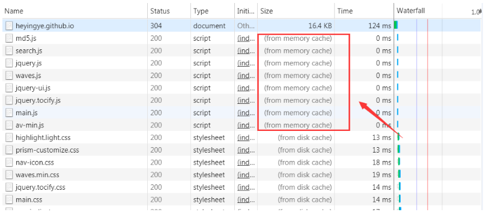

## 缓存
缓存的诞生主要是为了减少请求交互，对于浏览器来说就是更快的打开页面，更少的请求，但其实缓存问题并不只是在浏览器端，服务端也同样会有缓存问题，尤其服务端不支持热更新的时候，这里主要讲浏览器的缓存机制。
### 浏览器的缓存位置
浏览器通常是把缓存下来的文件，放到哪的呢？<br>


其实打开浏览器就能看见size一行很多都是from memory cache与from disk cache，并且你可以看见from disk cache消耗的时间与from memory cache消耗的时间，from memory cache基本都是0ms，证明from memory cache其实读取速度更快。

#### 内存缓存(from memory cache)
内存缓存具有更明显的优势，快速读取，但是缓存的时效性会随着进程的释放而释放了，比如你关闭了页面基本这个缓存就没了，重新打开该页面，又会发起新的请求。

#### 硬盘缓存(from disk cache)
硬盘缓存需要去系统硬盘里面读取资源，当然读取的速度会相对内存缓存慢一些，但是它的容量和时长是最好的，所以其实大部分资源会被缓存在硬盘里面，你用app或者浏览器一段时间发现越来越大，大部分都是因为硬盘缓存越来越多

浏览器自己的机制决定存在哪里，正常情况下大文件和使用频率很高的文件浏览器都会自动存储在硬盘中

#### Service Worker
如何缓存大部分都是浏览器自己的机制去决定的，但Service Worker给我们提供了开发者自己去决定控制缓存哪些文件，如何读取匹配缓存，是否去读缓存，这也是pwa的核心，这里不再细谈。

### 浏览器缓存过程
+ 浏览器发起请求，先查找自己有没有缓存以及缓存的标识，没有就请求
+ 浏览器拿到返回的结果把缓存和缓存的标识存入缓存中
+ 所以其实浏览器如何去缓存，大部分是根据服务端的标识，告诉它用什么样的缓存策略去缓存这个文件

### 浏览器的缓存策略
#### 强缓存
不会向服务器发送请求，直接从缓存中读取资源，强缓存可以设置HTTP Header实现，主要是Expires 和 Cache-Control<br>

**Expires**

Expires 是 HTTP/1 的产物，受限于本地时间，如果修改了本地时间，可能会造成缓存失效。所以现在基本都是Cache-Control的方式了。

**Cache-Control**

其实有很多属性，但是实际工作我遇到的大部分是以下几个属性<br>
+ max-age
max-age一般都是和'public, max-age=xxx'使用，表示就是在xxx时间内再次访问都走缓存，不再向服务器发起请求了

+ no-store
表示不使用缓存，所有的内容都不缓存，全部都要重新发起请求

+ no-cache
看字面意思，有可能你以为跟no-store有点像，以为是不缓存，其实这个表示的意思是不使用cache-control的那些属性来验证，no-cache其实是no-cache-control，不使用这个使用什么呢，也就是协商缓存了，所以看见这个属性大致也就是指协商缓存

#### 协商缓存
当被设置no-cache的时候，浏览器知道现在不能走强缓存策略了，于是开始读取协商缓存的那些标识属性，浏览器携带这些标识向服务器发起请求，由服务器告诉浏览器要不要使用缓存。

+ Last-Modified

看字面意思就知道是最后一次修改的时间，浏览器第一次请求的时候就会在响应头里面拿到这个标识，再次请求放到Request Header里的If-Modified-Since里，服务端拿到这个标识对比自己的，如果相同就表示无修改,就走缓存了。

+ ETag

Last-Modified一般是修改的时间，而ETag也跟字面意思一样，就是每次修改了就会有一个tag标识，资源变化了就会重新生成一个ETag，同理第一次请求，浏览器在响应头里面拿到这个标识，再次请求的时候放到Request Header里的If-None-Match里，服务端对比自己的etag，如果相同就表示无修改，走缓存。

其实ETag比Last-Modified更合理，Last-Modified是通过修改时间，而且是精确到秒的如果你在浏览器端把文件打开了，修改时间就变了，或者在1s内把时间改了，等等都有可能会造成错误对比

### 浏览器缓存方案

+ 前端界面设置meta
```
<meta http-equiv="Cache-Control" content="no-cache, no-store, must-revalidate" />
<meta http-equiv="Pragma" content="no-cache" />
<meta http-equiv="Expires" content="0" />
```
遗憾的是设置这个并不一定会起作用，浏览器会优先读取服务端返回的header的标识，而且这个meta属性并不是所有的浏览器都会支持。<br>
现在前端尤其大部分单页面，其实只要html不缓存，前端还是可以通过对js,css,img打包的hash来间接控制缓存。<br>

+ 服务端设置

长期不变化的可以设置强缓存，频繁变化的设置协商缓存

