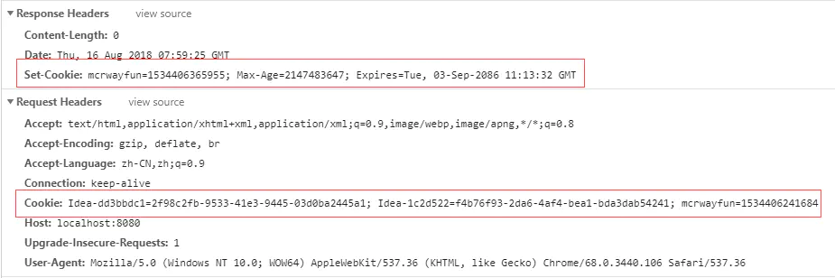
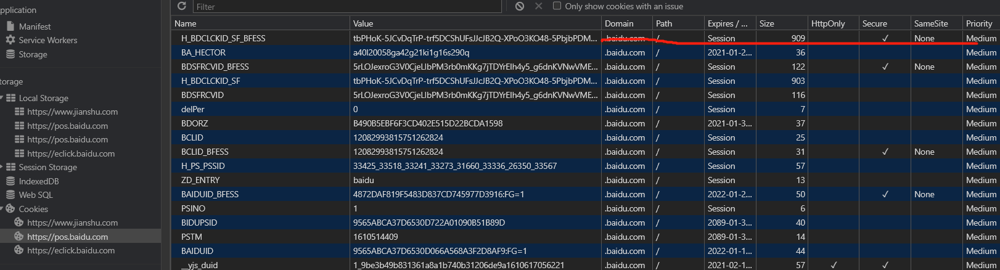

## cookie
为什么会出现cookie？ 
主要是现在主流的http协议，是无状态的协议，无状态的意思就是无法记录状态，对于http请求来说每一次都是独立的，各个请求之间没有直接联系。 
这样会产生一个问题，日常的前端开发涉及到用户，要怎么去记录每次请求都跟这个用户有联系呢，所以就需要请求每次都携带一个用户的标识，就诞生了cookie。(也不只是cookie，比如session等)

### cookie机制

+ 客户端发起一条请求到服务器
+ 服务器响应，响应里面就包括set-cookie的头部信息
+ 客户端保存下来，之后发起请求就携带cookie的头部信息

### cookie主要属性

随便从谷歌浏览器一个网站截图cookie的列表，每一条cookie都有Name,Value,Domain,Path,Expires/Max-Age,Size,HttpOnly,Secure,samesite,Priority等等属性

#### Domain
生成该 Cookie 的域名，如 domain="www.baidu.com"
cookie是不可以跨域名的，诞生可以通过设置domain来间接实现多域名共享cookie，例如设置domain='.baidu.com'，那么'a.baidu.com','b.baidu.com'都可以访问到这个cookie

#### Path
该 Cookie 是在当前的哪个路径下生成的，如 path=/wp-admin/。 
path属性决定允许访问Cookie的路径，比如，设置为"/"表示允许所有路径都可以使用Cookie。

#### Expires/Max-Age
这个属性主要是用来设置Cookie的有效期，Max-Age的值，其实你可以看到Expires显示的是 '2022-01-21T02:35:53.288Z'或者Session

其实通通跟设置的max-age有关系 
通过getMaxAge()和setMaxAge(int maxAge)来读写该属性。maxAge有3种值，分别为正数，负数和0。max-age单位为秒

max-age默认就是-1 
cookie默认是Session的，即cookie默认是浏览器会话期间存在，关闭浏览器就会被清除，此时max-age默认就是-1，如果想让cookie存在一段时间，就需要设置Max-Age为正数了，就会显示具体的失效时间了。

Max-Age为正数 
这里的这个时间也很好理解，无非就是当前的服务器时间跟它对比，到期就无效了呗（其实这个时间也是通过Max-Age计算出来的结果）

max-age为0 
当设置max-age为0的时候就表示清除cookie

#### HttpOnly
这个属性诞生主要还是因为安全，设置httpOnly主要是可以限制js等脚本去获取cookie，忽略那些通过"非 HTTP" 方式对 cookie 的访问。这个属性对于XSS,CSRF攻击其实都有很好的作用

#### secure
同样的，这个属性也是因为安全诞生的，主要的功能是设置secure，就只会在https得请求中才会携带cookie

#### samesite
samesite这个属性我在web安全得时候也提到过，对于CSRF攻击很有用，主要的作用就是限制cookie发送的条件，但是存在兼容性问题
通常情况下设置samesite的strict和lax已经能杜绝大部分CSRF了

strict完全禁止第三方 Cookie，跨站点时，任何情况下都不会发送 Cookie

Lax属于部分禁止
请求类型|示例|正常情况|Lax
--|:--:|--:|--:
链接|\<a href="..."></a\>|发送 Cookie|发送 Cookie
预加载|\<link rel="prerender" href="..."/\>|发送 Cookie|发送 Cookie
GET 表单|\<form method="GET" action="..."\>|发送 Cookie|发送 Cookie
POST 表单|\<form method="POST" action="..."\>|发送 Cookie|不发送
iframe|\<iframe src="..."></iframe\>|发送 Cookie|不发送
AJAX|$.get("...")|发送 Cookie|不发送
Image|\|发送 Cookie|不发送

None关闭该属性，HTTP 接口不支持 SameSite=none，如果你想加 SameSite=none 属性，那么该 Cookie 就必须同时加上 Secure 属性，表示只有在 HTTPS 协议下该 Cookie 才会被发送。(部分浏览器也存在兼容性问题)
### cookie的缺点
+ cookie的数量喝大小都有限制，通常情况下大小为4KB，数量大约50个
+ cookie的安全问题，存储再浏览器端，可以被篡改等
+ 每条请求携带cookie，增加请求大小