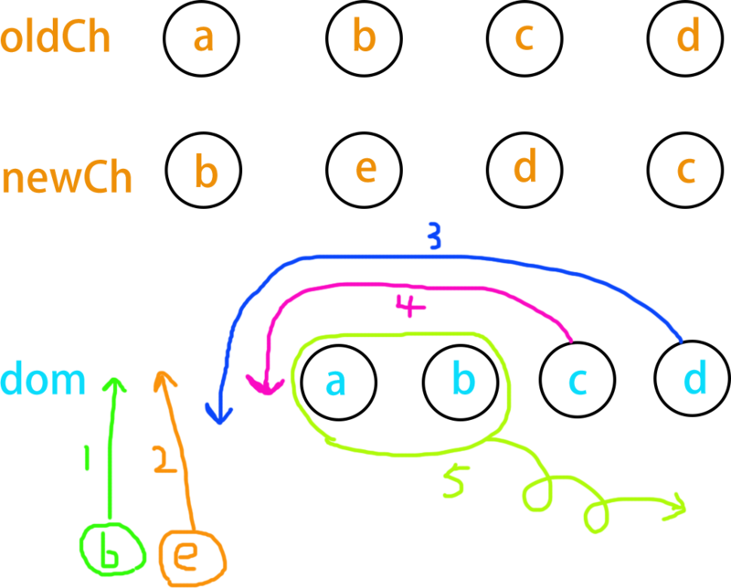
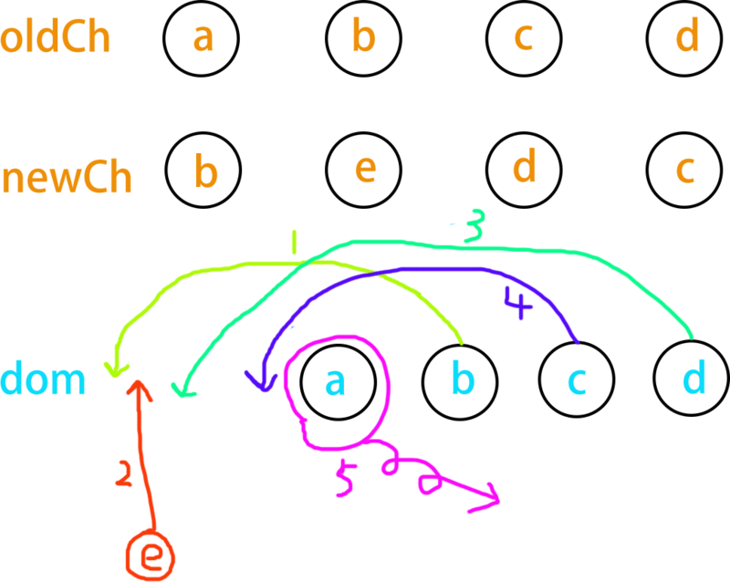

## diff算法
diff算法是用来干什么事情的？顾名思义就是来比较不同的算法，diff不就是different的缩写嘛。

对于前端来讲，大部分diff算法作用主要还是用来比较两颗DOM树的不同，尤其现在的前端框架例如vue react，也就是虚拟树(Virtual DOM)和真实树(Actual DOM)的不同
### 传统的diff算法
传统的diff算法比较两个树形结构，通过循环递归对所有的节点进行比较操作，算法的复杂度为O(n3)，n为树节点的总算。<br>
为什么是n3呢？<br>
同一级比较O(n1)，跨级比较O(n2)，最后还要根据前面比较出来的差异计算出最小的转换方式O(n3)，简单的1000个节点，都需要达到10亿次的比较，传统的diff无法直接用在前端框架中，所以react vue等对diff算法进行了优化，使其复杂度降低到O(n1)
### vue中的diff算法
传统的diff算法消耗这么大，vue到底是如何降低复杂度的呢？<br>
最重要的就是vue只进行同级比较，忽略跨级操作，自然而然的没有传统diff里面的跨级比较以及根据同级跨级差异计算最小转换方式的计算了。<br>

那么同级操作是如何实现diff的呢？<br>
#### 虚拟节点
```
<div id="v" class="classA"><div> 对应的 Vnode 就是

{
  el:  div  //对真实的节点的引用，本例中就是document.querySelector('#id.classA')
  tagName: 'DIV',   //节点的标签
  sel: 'div#v.classA'  //节点的选择器
  data: null,       // 一个存储节点属性的对象，对应节点的el[prop]属性，例如onclick , style
  children: [], //存储子节点的数组，每个子节点也是vnode结构
  text: null,    //如果是文本节点，对应文本节点的textContent，否则为null
}
```
#### patch
diff回调用patch函数，patch接收两个参数vnode，oldVnode
```
function patch (oldVnode, vnode) {
    //用来判断是不是同样类型的节点
    if (sameVnode(oldVnode, vnode)) {
        patchVnode(oldVnode, vnode)
    } else {
    //不同类型的节点，直接走else，走插入，删除节点的操作
        const oEl = oldVnode.el
        let parentEle = api.parentNode(oEl)
        createEle(vnode)
        if (parentEle !== null) {
            api.insertBefore(parentEle, vnode.el, api.nextSibling(oEl))
            api.removeChild(parentEle, oldVnode.el)
            oldVnode = null
        }
    }
    return vnode
}

function sameVnode(oldVnode, vnode){
   //两节点key值相同，并且sel属性值相同，即认为两节点属同一类型，可进行下一步比较
    return vnode.key === oldVnode.key && vnode.sel === oldVnode.sel
}
```
从上面的代码可以看出，patch函数内第一个if判断sameVnode(oldVnode, vnode)用来判断是不是同样类型的节点，只要节点的key和sel属性值不同，sameVnode就返回false，就认为是不同类型的节点，直接走else，走插入删除节点的操作。<br>

sel属性我们可以看到 'sel': 'div#v.classA' 其实就是描述这个节点的dom类型，包括class等，很好理解不同的话肯定就是不同的节点。<br>

key对于vue的特殊之处就可以明显的感觉到了，这也是为什么vue的key如此重要，它是会影响到算法来判断sameVnode是不是相同节点的一个重要标志。<br>

#### patchVnode
从patch函数中可以看到，如果被vue的sameVnode判断为相同节点的会走patchVnode(oldVnode, vnode)函数。

其实这个代码块主要是来判断新旧节点的子节点的情况的，根据新旧节点子节点的各种异同情况走不同的处理。尤其都有子节点，且子节点都不相同的情况会走另外一个重要的函数updateChildren。

```
patchVnode (oldVnode, vnode) {
    const el = vnode.el = oldVnode.el  //很重要的一步让vnode.el引用到现在的真实dom，当el修改时，vnode.el会同步变化。
    let i, oldCh = oldVnode.children, ch = vnode.children
    if (oldVnode === vnode) return  //新旧节点的引用一致，认为没有变化，就不做任何操作
   
    if (oldVnode.text !== null && vnode.text !== null && oldVnode.text !== vnode.text) {
     //新旧节点文本节点的比较，如果不同就set新节点的文本
        api.setTextContent(el, vnode.text)
    }else {
        updateEle(el, vnode, oldVnode)     
        if (oldCh && ch && oldCh !== ch) {
            //新旧节点都有子节点，并且比较了一下还不相同就调用updateChildren
            updateChildren(el, oldCh, ch)
        }else if (ch){  
            //只有新节点有子节点，添加新的子节点
            createEle(vnode) 
        }else if (oldCh){  
            //只有旧节点内存在子节点，执行删除old子节点操作
            api.removeChildren(el)
        }
    }
}
```
#### updateChildren
当新旧节点都有子节点，并且还都不相同就会进入updateChildren这个函数
```
updateChildren (parentElm, oldCh, newCh) {
    let oldStartIdx = 0, newStartIdx = 0
    let oldEndIdx = oldCh.length - 1
    let oldStartVnode = oldCh[0]
    let oldEndVnode = oldCh[oldEndIdx]
    let newEndIdx = newCh.length - 1
    let newStartVnode = newCh[0]
    let newEndVnode = newCh[newEndIdx]
    let oldKeyToIdx
    let idxInOld
    let elmToMove
    let before
    while (oldStartIdx <= oldEndIdx && newStartIdx <= newEndIdx) {
            if (oldStartVnode == null) {   //对于vnode.key的比较，会把oldVnode = null
                oldStartVnode = oldCh[++oldStartIdx] 
            }else if (oldEndVnode == null) {
                oldEndVnode = oldCh[--oldEndIdx]
            }else if (newStartVnode == null) {
                newStartVnode = newCh[++newStartIdx]
            }else if (newEndVnode == null) {
                newEndVnode = newCh[--newEndIdx]
            }else if (sameVnode(oldStartVnode, newStartVnode)) {
                patchVnode(oldStartVnode, newStartVnode)
                oldStartVnode = oldCh[++oldStartIdx]
                newStartVnode = newCh[++newStartIdx]
            }else if (sameVnode(oldEndVnode, newEndVnode)) {
                patchVnode(oldEndVnode, newEndVnode)
                oldEndVnode = oldCh[--oldEndIdx]
                newEndVnode = newCh[--newEndIdx]
            }else if (sameVnode(oldStartVnode, newEndVnode)) {
                patchVnode(oldStartVnode, newEndVnode)
                api.insertBefore(parentElm, oldStartVnode.el, api.nextSibling(oldEndVnode.el))
                oldStartVnode = oldCh[++oldStartIdx]
                newEndVnode = newCh[--newEndIdx]
            }else if (sameVnode(oldEndVnode, newStartVnode)) {
                patchVnode(oldEndVnode, newStartVnode)
                api.insertBefore(parentElm, oldEndVnode.el, oldStartVnode.el)
                oldEndVnode = oldCh[--oldEndIdx]
                newStartVnode = newCh[++newStartIdx]
            }else {
               // 使用key时的比较
                if (oldKeyToIdx === undefined) {
                    oldKeyToIdx = createKeyToOldIdx(oldCh, oldStartIdx, oldEndIdx) // 有key生成index表
                }
                idxInOld = oldKeyToIdx[newStartVnode.key]
                if (!idxInOld) {
                    api.insertBefore(parentElm, createEle(newStartVnode).el, oldStartVnode.el)
                    newStartVnode = newCh[++newStartIdx]
                }
                else {
                    elmToMove = oldCh[idxInOld]
                    if (elmToMove.sel !== newStartVnode.sel) {
                        api.insertBefore(parentElm, createEle(newStartVnode).el, oldStartVnode.el)
                    }else {
                        patchVnode(elmToMove, newStartVnode)
                        oldCh[idxInOld] = null
                        api.insertBefore(parentElm, elmToMove.el, oldStartVnode.el)
                    }
                    newStartVnode = newCh[++newStartIdx]
                }
            }
        }
        if (oldStartIdx > oldEndIdx) {
            before = newCh[newEndIdx + 1] == null ? null : newCh[newEndIdx + 1].el
            addVnodes(parentElm, before, newCh, newStartIdx, newEndIdx)
        }else if (newStartIdx > newEndIdx) {
            removeVnodes(parentElm, oldCh, oldStartIdx, oldEndIdx)
        }
}
```
上面的代码粗略看一眼，你会看到很多熟悉的关键函数patchVnode，sameVnode，addVnodes，removeVnodes，insertBefore还有一些关键的变量oldStartIdx，oldEndIdx，oldEndVnode，oldStartVnode。<br>
其实具体的行为就是由两端至中间的对比，移动，删除，插入。具体的节点还分为有key和无key的情况<br>

无key的时候，b即使旧节点有相同的也不会复用，而是直接创建新的，删除旧的<br>



有key的时候，b会得到复用

